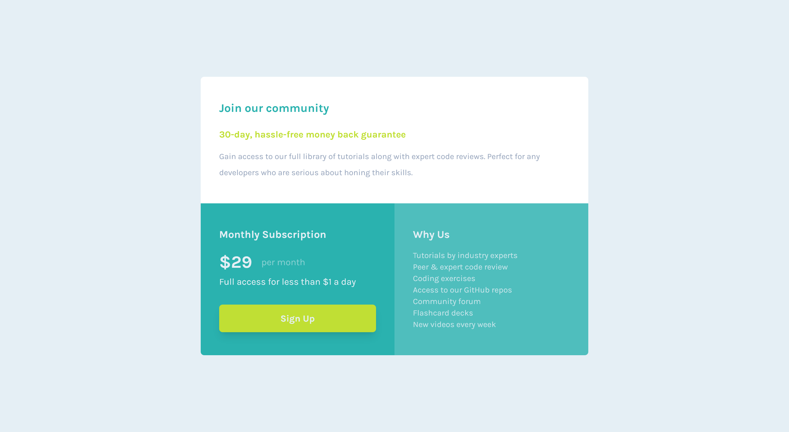

# Frontend Mentor - Single price grid component solution

This is a solution to the [Single price grid component challenge on Frontend Mentor](https://www.frontendmentor.io/challenges/single-price-grid-component-5ce41129d0ff452fec5abbbc). Frontend Mentor challenges help you improve your coding skills by building realistic projects. 

## Table of contents

- [Overview](#overview)
  - [The challenge](#the-challenge)
  - [Screenshot](#screenshot)
  - [Links](#links)
- [My process](#my-process)
  - [Built with](#built-with)
  - [What I learned](#what-i-learned)
  - [Continued development](#continued-development)
- [Author](#author)

## Overview

### The challenge

Users should be able to:

- View the optimal layout for the component depending on their device's screen size
- See a hover state on desktop for the Sign Up call-to-action

### Screenshot

### Links

- Solution URL: (https://github.com/djbedford/fm-single-price-grid-component)
- Live Site URL: (https://illustrious-cactus-d17e13.netlify.app/)

## My process

### Built with

- Semantic HTML5 markup
- Flexbox
- CSS Grid
- Mobile-first workflow
- [Tailwind CSS](https://tailwindcss.com) - A utility-first CSS framework

### What I learned

I used CSS grid to build out the responsive layout and help me complete it this challenge so I had to learn about how Tailwind CSS implements the CSS grid feature, this has allowed me to dig deeper in to Tailwinds' documentation and gain a stronger understanding of Tailwind CSS.

### Continued development

I would like to continue looking at using CSS grid to implement responsive layouts in future projects.

## Author

- Frontend Mentor - [@djbedford](https://www.frontendmentor.io/profile/djbedford)
- Twitter - [@djbedford](https://www.twitter.com/djbedford)
